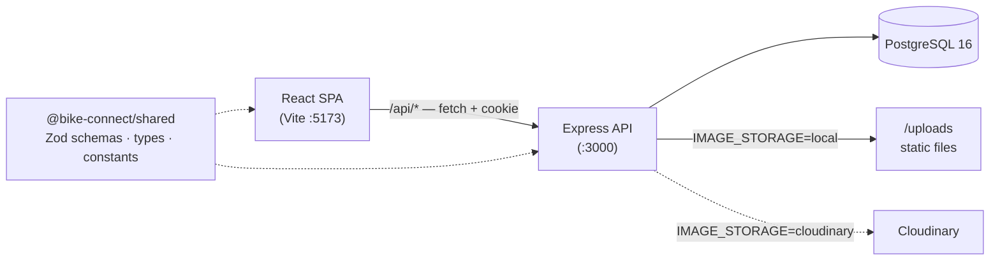

# Bike Connect

A full-stack web platform that unifies the three activities of the modern
cyclist: managing bikes, journaling their maintenance, and sharing the
experience through long-form writing. One identity, one domain model — rides, the
bikes that took them, and the stories written about them all live in the same
place.

> **New to the codebase?** Start with **[ONBOARDING.md](./ONBOARDING.md)** for an
> architecture walk-through, the request lifecycle, conventions, and recipes.

---

## Contents

- [Features](#features)
- [Tech stack](#tech-stack)
- [Architecture](#architecture)
- [Repository layout](#repository-layout)
- [Getting started](#getting-started)
- [Environment variables](#environment-variables)
- [Scripts](#scripts)
- [Database](#database)
- [API overview](#api-overview)
- [Testing](#testing)
- [Conventions](#conventions)
- [Known gaps](#known-gaps)
- [License](#license)

---

## Features

- **Blog** — rich-text posts (Tiptap, stored as JSONB), one-level threaded
  comments, likes, bookmarks, tags, and Postgres full-text search.
- **Garage** — a personal bike registry with per-bike components. Any bike can be
  flipped to a read-only public page and surfaced on the explore page. Bikes carry
  a hero photo uploaded through the image pipeline.
- **Maintenance** — per-component service logs. Reminders are **computed** from the
  logs, accumulated mileage, and per-category thresholds — never stored.
- **Rides** — distance / duration / date logging that rolls up into per-bike
  mileage and "this month" stats.
- **Social** — follow authors and read a personal, keyset-paginated feed.
- **Auth** — Google OAuth 2.0 via Passport; a stateless JWT carried in an
  `httpOnly` cookie.
- **Theming** — light/dark mode with a flash-free pre-paint and a shared design-token system.

---

## Tech stack

| Tier | Technology |
|------|------------|
| **Client** | React 19, Vite 6, react-router 7, Tiptap v3, plain CSS + design tokens |
| **Server** | Node 22, Express 5, TypeScript (strict, ESM), Passport (Google OAuth), Multer |
| **Data** | PostgreSQL 16, Kysely (type-safe query builder), JSONB + `tsvector` |
| **Shared** | Zod schemas, inferred types, and constants consumed by client *and* server |
| **Images** | Pluggable storage — local disk (dev) or Cloudinary |
| **Testing** | Vitest, Playwright (+ `@axe-core/playwright`), testcontainers |
| **Tooling** | npm workspaces, TypeScript project references, GitHub Actions CI |

---

## Architecture

A React single-page app talks to an Express JSON API over `/api` (credentialed
fetch with an `httpOnly` JWT cookie). Both sides share one Zod-derived contract.



The server is layered per domain — **routes → controller → service → repository →
db** — and only the repository touches SQL. See
[ONBOARDING.md](./ONBOARDING.md) for the full request lifecycle.

---

## Repository layout

npm workspaces monorepo:

```
client/   React SPA — feature folders under src/features/, shared kit in src/components/ui/
server/   Express API — domain modules under src/modules/ (routes → controller → service → repository)
shared/   Zod schemas, inferred types, constants — the single source of truth
scripts/  check-coverage.mjs (coverage gate), db-backup.sh
docs/     project documentation
docker-compose.yml   PostgreSQL 16 for local development
```

---

## Getting started

**Requirements:** Node 22 (`.nvmrc`), Docker (for PostgreSQL).

```bash
nvm use                       # Node 22
npm install                   # all workspaces
cp .env.example .env          # then fill in / adjust (see below)
docker compose up -d          # PostgreSQL 16 on localhost:5432
npm run db:migrate            # apply migrations
npm run db:seed               # optional — demo data
npm run dev                   # client (:5173) + server (:3000)
```

Open **http://localhost:5173**. The API health check is `GET /api/health`.

> The app boots without real Google credentials in development (the OAuth vars and
> `JWT_SECRET` have dev defaults). Actual Google sign-in needs real OAuth
> credentials in `.env`.

---

## Environment variables

A single `.env` at the repo root serves every workspace. The authoritative list,
with defaults and validation, is **`server/src/config/env.ts`** (parsed by Zod).

| Variable | Default (dev) | Required in prod |
|----------|---------------|:----------------:|
| `NODE_ENV` | `development` | — |
| `PORT` | `3000` | — |
| `DATABASE_URL` | local Postgres URL (matches docker-compose) | ✅ |
| `GOOGLE_CLIENT_ID` | placeholder | ✅ |
| `GOOGLE_CLIENT_SECRET` | placeholder | ✅ |
| `JWT_SECRET` | dev default (≥32 chars) | ✅ (min 32) |
| `JWT_EXPIRY` | `7d` | — |
| `CORS_ORIGIN` | `http://localhost:5173` | ✅ |
| `IMAGE_STORAGE` | `local` | — (`local` \| `cloudinary`) |
| `CLOUDINARY_URL` | — | only if `IMAGE_STORAGE=cloudinary` |
| `LOCAL_UPLOAD_DIR` | `./uploads` | — |
| `RATE_LIMIT_WINDOW_MS` | `900000` | — |
| `RATE_LIMIT_MAX` | `1000` | — |

---

## Scripts

Run from the repo root (most delegate into the workspaces):

| Script | What it does |
|--------|--------------|
| `npm run dev` | client + server in watch mode (concurrently) |
| `npm run build` | builds in order: `shared → server → client` |
| `npm run typecheck` | `tsc` across all three workspaces |
| `npm run lint` | ESLint — **not configured yet** (see [Known gaps](#known-gaps)) |
| `npm test` | unit/integration tests across all workspaces |
| `npm run test:coverage` | tests with coverage + threshold gate |
| `npm run test:ci` | CI entrypoint (`NODE_ENV=test` coverage run) |
| `npm run db:migrate` | apply database migrations |
| `npm run db:migrate:create` | scaffold a new migration |
| `npm run db:seed` | seed demo data (`-w server`) |

Per-workspace variants exist too, e.g. `npm test -w server`,
`npm run dev -w client`, `npm run build -w shared`.

---

## Database

PostgreSQL 16 via `docker-compose.yml`, accessed through Kysely (typed query
builder, no ORM). The schema is mirrored in TypeScript at
`server/src/db/types.ts`; migrations live in `server/src/db/migrations/`
(`001_initial_schema`, `002_stretch_features`, `003_performance_indexes`).

```bash
docker compose up -d          # start Postgres
npm run db:migrate            # apply migrations
npm run db:seed               # demo data
npm run db:migrate:create     # new migration
```

**Tables:** `users`, `posts`, `tags`, `post_tags`, `comments`, `likes`,
`bookmarks`, `follows`, `bikes`, `bike_components`, `maintenance_logs`, `rides`.
Maintenance reminders are computed, not stored.

---

## API overview

All endpoints are under `/api`; sub-resources nest under their parent. Errors use
a consistent JSON shape: `{ status, code, message, details? }`.

| Resource | Mount | Notes |
|----------|-------|-------|
| Auth | `/api/auth` | Google OAuth start, `/me`, logout |
| Posts | `/api/posts` | list, mine, search, by slug/id, CRUD |
| Comments / Likes / Bookmark | `/api/posts/:postId/{comments,likes,bookmark}` | nested under a post |
| Tags | `/api/tags` | list, by slug |
| Bikes | `/api/bikes` | list, explore, CRUD |
| Components / Maintenance / Rides / Reminders | `/api/bikes/:id/{components,maintenance,rides,reminders}` | nested under a bike |
| Users | `/api/users` | profile, `/me`, ride-stats, bikes, activity |
| Follows | `/api/users/:id/follows` | stats, toggle, followers, following |
| Feed | `/api/feed` | keyset-paginated |
| Images | `/api/images/upload` | multipart upload → `{ url }` |
| Bookmarks | `/api/me/bookmarks` | current user's bookmarks |

Full per-endpoint detail is in [ONBOARDING.md §6](./ONBOARDING.md#6-the-api-surface).

---

## Testing

| Layer | Tooling | Location |
|-------|---------|----------|
| Unit | Vitest | each workspace's `test/` (+ colocated tests in `shared`) |
| Integration | Vitest + testcontainers (ephemeral PostgreSQL 16) | `server/test/` |
| E2E + a11y | Playwright + `@axe-core/playwright` | `client/e2e/` |

Coverage target is **≥ 95%** (aim 100%), enforced by `scripts/check-coverage.mjs`
against `.coverage-threshold.json`. Integration tests spin up a real Postgres
container — no database mocking.

```bash
npm test                      # all unit/integration tests
npm run test:coverage         # with the coverage gate
npm test -w server            # one workspace
cd client && npx playwright test   # E2E
```

---

## Conventions

- **ESM only**, with `.js` extensions on relative imports (source is `.ts`).
- **Strict TypeScript** (`tsconfig.base.json`): no `any`, `noUncheckedIndexedAccess`,
  `noUnusedLocals/Parameters`. Prefer inference.
- **`shared` is the contract** — change request/response shapes there, and both
  client and server follow. Rebuild `shared` after schema changes.
- **Accessibility (WCAG 2.1 AA)** is a requirement: semantic HTML, labelled inputs,
  visible focus, sufficient contrast (axe-core runs in E2E).
- Tests live in `test/` (and `client/e2e/`) — never in `__tests__` folders.

See [ONBOARDING.md](./ONBOARDING.md) for the detailed standards and recipes.

---

## Known gaps

- **Lint is not wired up.** The `lint` scripts and the CI lint step call
  `eslint .`, but ESLint is not installed and there is no config, so
  `npm run lint` currently fails. Type safety is enforced via `npm run typecheck`
  in the meantime. Adding an ESLint flat config closes this gap.
- **CI triggers on `main`** (`.github/workflows/ci.yml`: install → lint →
  typecheck → `test:ci`), while local development happens on `master`.

---

## License

[MIT](LICENSE)
